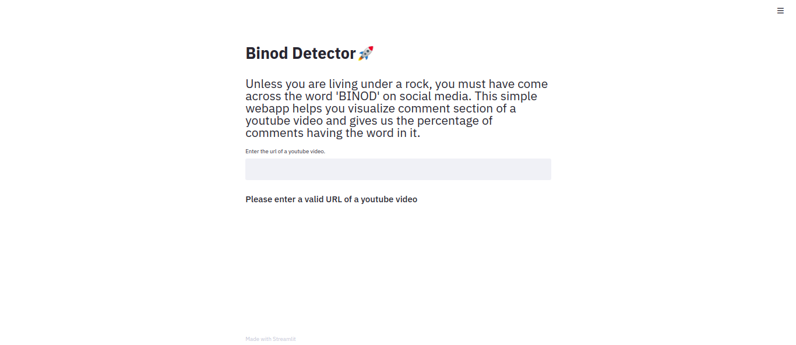

# Binod Detector

Gives us the distribution of comments in a particular video which has 'BINOD' in it.

It uses Youtube API to get the comments of a particular video, and then presents the visualizations after text preprocessing

[Here](https://developers.google.com/youtube/registering_an_application) is where you can find how to obtain the API Key

## Website (Visit [here](https://binod-detector.herokuapp.com/))
